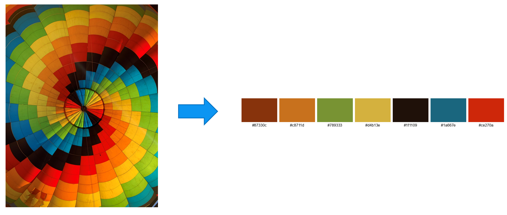

# img2palette

A python-based program that returns a color palette from an image using K-Means clustering algorithm.


*[Image](https://commons.wikimedia.org/wiki/File:Inside_of_a_hot_air_balloon.jpg) by [Hu Nhu](https://commons.wikimedia.org/wiki/User:Hu_Nhu), licensed under [CC BY-SA 4.0](https://creativecommons.org/licenses/by-sa/4.0/deed.en).*

## Installation

1. Clone the repository
```bash
   git clone https://github.com/wb73-eu/img2palette.git
   cd img2palette
```

2. (Optional) Create and activate a virtual environment
```bash
    python3 -m venv venv
    source venv/bin/activate   # Unix/macOS
    venv\Scripts\activate 
```

3. Install required packages
```bash
pip install -r requirements.txt
```

## Usage
Basic usage from the command line:
```bash
python palette_extractor.py input.jpg
```

### Options

* `input.jpg` : source image path.
* `--num_colors`/`-n` : number of colors in the extracted palette (The default value is `5`).
* `--color_space`/`-c` : color space used for plotting pixels before applying K-Means (`RGB` or `HSV`, default is `RGB`).

### Example
Input :

```bash
python palette_extractor.py test_image.jpg --n 8
```
Output :

```bash
Dominant Colors (RGB)
 - (5, 5, 4)
 - (151, 8, 20)
 - (27, 135, 69)
 - (116, 64, 133)
 - (210, 232, 247)
 - (242, 113, 238)
 - (198, 82, 25)
 - (60, 137, 230)
```